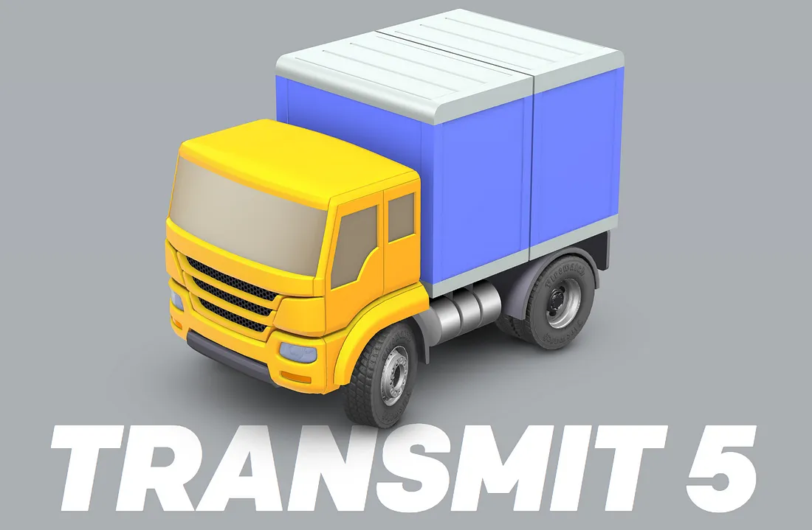

# Intro to 3D with Three.js

> A 3D Interactive Logo on Panic Inc.’s website for their file transfer client, [Transmit](https://panic.com/transmit/)

Scanning through suggested topics for a presentation project that is part of the bootcamp I am currently attending, I notice an aptly named JavaScript library — to be fair, I had realized it was aptly named only after visiting its official website — that had not yet been selected by any of the peers in my cohort. For whatever odd reason, skimming through the documentation of this library had me reminiscing to my childhood days of playing around with Flash animation and stop-motion animation. Before long, I had submitted my topic selection for approval and off I went to explore the Three.js docs.

::: warning DISCLAIMER
The following is based on research I’ve dug up while trying to learn how to make this library work for my purposes. I apologize in advance if I get anything factually incorrect, but please let me know if you do see something!
:::

### What is Three.js?

Three.js is a JavaScript library used to create three dimensional animation to be displayed in a web browser. Its roots date back at least 8 years and have undergone almost 100 revisions. With 1,000+ contributors, 46.7k stars, and 17.7k forks on Github at the time of writing this, it’s a popular animation library to say the least.

## Getting Started

Following the Getting Started docs on the official website made it fairly easy to get a simple, animated cube up and spinning around on my web page. In addition, the structure and setup of the library was so verbose it was possible for a beginner such as myself to even pick up on it.

The Spinning Cube tutorial from the Getting Started docs of threejs.org

I thought of Three.js, in its most basic form, as being similar to videography. Both need a camera which record and represent a perspective of your content to be inherited by a viewer. Both also need scenes, which contain actors, props, and environment, that act as content for your viewers to engage in. Lastly, a method of conveying your content to your audience is required. In videography, this might be a theatre screen. In Three.js and the world of computer graphics, this is called a renderer.

Make sure to link the Three.js library to your HTML markup before proceeding.

## Turning the Analogy into Code

### The Camera

Let’s first set up the camera in our code. I’ve set up a nice green screen to show where our animation container is, because, you know, computer graphics and green screens right? _/sarcasm_

<iframe height="300" style="width: 100%;" scrolling="no" title="Intro to 3D with Three.js - Part 1: The Camera" src="https://codepen.io/vwstang/embed/preview/zyogKd?default-tab=js%2Cresult&theme-id=dark" frameborder="no" loading="lazy" allowtransparency="true" allowfullscreen="true">
  See the Pen <a href="https://codepen.io/vwstang/pen/zyogKd">
  Intro to 3D with Three.js - Part 1: The Camera</a> by Vince (<a href="https://codepen.io/vwstang">@vwstang</a>)
  on <a href="https://codepen.io">CodePen</a>.
</iframe>

The first two lines of code grabs the width and height of the container which will be used to display animations. The width and height is used to instantiate the components we need, but is also going to be needed so that the renderer responds to window resizes.

The next four lines are going to be used to create our camera. In simplest words, the viewAngle represents the vertical field of view the camera. The `aspectRatio` is typically equal to the `sceneWidth` divided by the `sceneHeight`. The last two values, near and far represent draw distances that tell the renderer what objects to draw depending on their relative distance to the camera within the three-dimensional space.

> Viewing Frustum (source: [yourdictionary.com](https://yourdictionary.com))

These four values define our camera’s “pyramid of vision”. Any objects in our scene that exist at anytime within this _sorta-pyramid-shaped_ space will be drawn onto our browser screens.

The last line instantiates our camera by passing the previous four values as arguments in its declaration.

### The Scene

Let’s set up our scene.

<iframe height="300" style="width: 100%;" scrolling="no" title="Intro to 3D with Three.js - Part 2: The Scene" src="https://codepen.io/vwstang/embed/preview/vvgBjG?default-tab=js%2Cresult&theme-id=dark" frameborder="no" loading="lazy" allowtransparency="true" allowfullscreen="true">
  See the Pen <a href="https://codepen.io/vwstang/pen/vvgBjG">
  Intro to 3D with Three.js - Part 2: The Scene</a> by Vince (<a href="https://codepen.io/vwstang">@vwstang</a>)
  on <a href="https://codepen.io">CodePen</a>.
</iframe>

Pretty simple — we create a new constant to store an instance of the Three.js Scene class and then add our camera to the scene using the `.add()` method. We also set our camera’s position in the three-dimensional plane and the coordinates that it looks at.

### The Renderer

Here’s what we need to get our scene displayed on our screens.

<iframe height="300" style="width: 100%;" scrolling="no" title="Intro to 3D with Three.js - Part 3: The Renderer" src="https://codepen.io/vwstang/embed/preview/NedKVM?default-tab=js%2Cresult&theme-id=dark" frameborder="no" loading="lazy" allowtransparency="true" allowfullscreen="true">
  See the Pen <a href="https://codepen.io/vwstang/pen/NedKVM">
  Intro to 3D with Three.js - Part 3: The Renderer</a> by Vince (<a href="https://codepen.io/vwstang">@vwstang</a>)
  on <a href="https://codepen.io">CodePen</a>.
</iframe>

Instantiate a renderer and store it into a constant. Three.js comes packaged with different types of renderers (such as _SVG Renderer_ and _Canvas Renderer_), but we’ll use _WebGL Renderer_ here. Sources say that _WebGL Renderer_ is the one to use at it makes use of your computer’s GPU, whereas the others don’t and are therefore weaker in terms of performance. As well, many built-in Three.js methods are designed to work with _WebGL Renderer_ first and foremost, so the best bet would be to stick to that one.

We’ll want to set the renderer’s size with the `.setSize()` method and pass it the `sceneWidth` and `sceneHeight` variables we created in the beginning. Then, we’ll append the `.domElement` of the renderer to our DOM.

Next, we create a function called “update” that will tell the renderer to render our scene and camera. What a verbose function!

`requestAnimationFrame()` is a method of the `window` object that tells the browser that you wish to perform an animation and requests that the browser call a specified function to update an animation before the next repaint (_source: [developer.mozilla.org](developer.mozilla.org)_). So, we’ll pass our update function in as a callback to this method. Our function will call this method, which passes itself as a callback, and thus create our continuous animation.

Hooray for infinite loops!

You should see that the green screen is now black. We can add lighting to our scene to change that, but for the purposes of this introductory article, we’re not going to do that.

We now have the most basic setup ready for animation!

### Add Objects and Animations to the Scene

We can create geometric shapes using built-in methods in Three.js. Taking a look at the [documentation](https://threejs.org/docs/index.html#api/en/geometries/BoxGeometry), we can see that there are many different pre-built geometric shapes that can be created using the listed methods. We can explore those in a future article, but for today, just to make a thing and make that thing show up animated on our screen, let’s create a [modified version of the] cube that’s in the official [_Getting Started_](https://threejs.org/docs/index.html#manual/en/introduction/Creating-a-scene) documentation.

<iframe height="300" style="width: 100%;" scrolling="no" title="Intro to 3D with Three.js - Part 4: Adding Things to the Scene" src="https://codepen.io/vwstang/embed/preview/BvpaXb?default-tab=js%2Cresult&theme-id=dark" frameborder="no" loading="lazy" allowtransparency="true" allowfullscreen="true">
  See the Pen <a href="https://codepen.io/vwstang/pen/BvpaXb">
  Intro to 3D with Three.js - Part 4: Adding Things to the Scene</a> by Vince (<a href="https://codepen.io/vwstang">@vwstang</a>)
  on <a href="https://codepen.io">CodePen</a>.
</iframe>

Remember to add your cube to the scene with `scene.add()`, otherwise you won’t be able to see it on your screen! Also note that I’ve added two lines that increment the cube object’s x and y axis rotation values by 0.01 on each animation frame update.

Note that in an earlier version of part 4 of the CodePens above, I had used `BoxGeometry()` to create the cube in our scene. This has since been updated to `BoxBufferGeometry()` as the former will soon be deprecated.

And there you have it, a very basic introduction to 3D animation you can use on your website.

 

 

::: info EDIT 1
To point out the code that animates the cube in the update function.
:::

::: info EDIT 2
Change from `BoxGeometry()` to `BoxBufferGeometry()` due to impending deprecation. Thanks [Lewy Blue | Discover three js](https://medium.com/@lewy_blue) for pointing this out! Check out his upcoming book for a legit dive into Three.js.
:::

::: info EDIT 3
Ported this article over from [Medium](https://medium.com/p/c826891f452), originally published there on Dec 19, 2018. Lewy seems to have completed the book already, accessible online for free at [https://discoverthreejs.com](https://discoverthreejs.com/)
